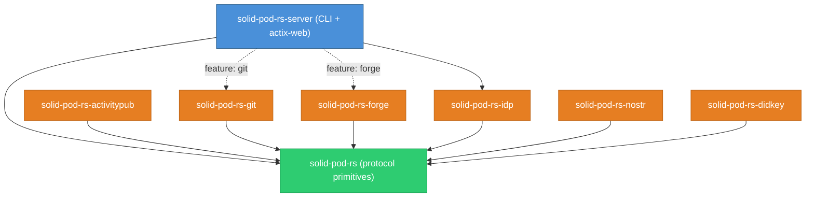

# solid-pod-rs

**A Rust-native port of [JavaScriptSolidServer](https://github.com/JavaScriptSolidServer/JavaScriptSolidServer) (JSS)** — the reference implementation of the [Solid Protocol](https://solidproject.org/TR/protocol). solid-pod-rs is the **personal-data-sovereignty layer** of the DreamLab ecosystem: it gives every human and every agent a self-owned RDF data store — a **pod** — under their own key, with WAC access control, did:nostr identity, and a sovereign, Bitcoin-settled HTTP-402 trust ledger. Every write to a pod is a git-mark commit; high-value writes anchor to the Bitcoin chain. The exit right sits in the floor, not granted at the door. Pre-1.0, AGPL-3.0 by design.

[](./LICENSE)
[](https://crates.io/crates/solid-pod-rs)
[](https://docs.rs/solid-pod-rs)
[](https://github.com/DreamLab-AI/solid-pod-rs/actions/workflows/ci.yml)
[](https://releases.rs/docs/1.88.0/)

**Maintainer**: [John O'Hare](https://github.com/jjohare) · **Upstream IP**: [Melvin Carvalho](https://github.com/melvincarvalho) ([JSS](https://github.com/JavaScriptSolidServer/JavaScriptSolidServer), the AGPL-3.0 reference Solid pod server) · [MAINTAINERS.md](MAINTAINERS.md)

New to Solid, RDF/JSON-LD, WAC, or did:nostr? The concepts live in one place: the [Solid primer for Rust developers](crates/solid-pod-rs/docs/explanation/solid-primer.md). This README stays on what solid-pod-rs is and where it sits.

---

> **Your data's exit right should sit in the floor, not be granted at the door — solid-pod-rs gives every human and agent a self-owned RDF pod under their own key.** A Rust-native Solid Protocol server with WAC access control and `did:nostr` identity; every write is a git-mark commit and high-value writes anchor to Bitcoin. Standards-based sovereignty: leave at any time, and take everything with you.

---

## Part of VisionFlow

solid-pod-rs is the sovereign data layer of [**VisionFlow**](https://github.com/DreamLab-AI/VisionFlow) — a seven-repo mesh for human–AI coordination built on one identity spine: `did:nostr` as login, WAC principal, provenance author, DID subject, and payment account, all from a single keypair. Pods are the canonical store the other components read from and write to. The mesh pairs that data sovereignty with a shared formal semantic layer — OWL 2 EL reasoning in VisionClaw bounds what agents assert, the arrangement the industry now calls neurosymbolic — so a pod holds data whose meaning is checked, not merely stored.

| Repository | Role |
|:-----------|:-----|
| [DreamLab-AI/VisionFlow](https://github.com/DreamLab-AI/VisionFlow) | Ecosystem canon — ADRs, PRDs, the compatibility matrix, marketing site and vision report. |
| [DreamLab-AI/VisionClaw](https://github.com/DreamLab-AI/VisionClaw) | Flagship engine — ontology-grounded immersive 3D knowledge graph, OWL 2 EL + Whelk, GPU physics. |
| [DreamLab-AI/agentbox](https://github.com/DreamLab-AI/agentbox) | Sovereign agent runtime — Nix container, did:nostr agent identities, RuVector memory, Solid-pod bridge. |
| **[DreamLab-AI/solid-pod-rs](https://github.com/DreamLab-AI/solid-pod-rs)** | **The personal-data-sovereignty layer — this repo.** |
| [DreamLab-AI/nostr-rust-forum](https://github.com/DreamLab-AI/nostr-rust-forum) | Nostr-native forum + relay — the human+agent communication and governance substrate. |
| [DreamLab-AI/dreamlab-ai-website](https://github.com/DreamLab-AI/dreamlab-ai-website) | DreamLab AI company website — the commercial face. |
| [DreamLab-AI/knowledgeGraph](https://github.com/DreamLab-AI/knowledgeGraph) | narrativegoldmine.com — the published public knowledge graph, the corpus VisionClaw renders in 3D; main also releases that corpus and its build pipeline as open data, 7,457 pages under ODbL-1.0. |

Each sibling in its own words:

<details>
<summary><b>VisionFlow</b> — <em>ecosystem canon — ADRs, PRDs, the compatibility matrix, marketing site and vision report</em></summary>
<br/>

> **Six honest systems can still assemble one collective lie — VisionFlow is the canon that stops that.** It holds the ADRs, PRDs, compatibility matrix and honest status ledger for a seven-repo human–AI mesh built on one wager: AI collapses the cost of routing information, so the human is promoted from router to judgment broker. This repo ships words, not runtime — and it is graded on their accuracy.

</details>

<details>
<summary><b>VisionClaw</b> — <em>flagship engine — ontology-grounded immersive 3D knowledge graph, OWL 2 EL + Whelk, GPU physics</em></summary>
<br/>

> **Agent swarms are invisible; VisionClaw makes them something you can stand inside and watch.** It reasons over a curated corpus with an OWL 2 EL engine (Whelk, 5,975 classes), settles the result as a 3D graph under GPU physics, and renders agents acting inside it — desktop and Quest 3 alike, every agent action drawn as a beam to the concept it touched. It observes and never signs: the engine you can watch is deliberately not the surface that can commit.

</details>

<details>
<summary><b>agentbox</b> — <em>sovereign agent runtime — Nix container, did:nostr agent identities, RuVector memory, Solid-pod bridge</em></summary>
<br/>

> **An agent runtime you can't reproduce is an audit you can't run — Agentbox is a byte-for-byte reproducible Nix container driven by one TOML manifest.** Every agent is minted its own `did:nostr` key at spawn, every durable write passes a privacy filter into a cryptographic audit trail, and what agents may touch is bounded by explicit fail-closed gates. Reproduce the runtime, audit every action, control every capability.

</details>

<details>
<summary><b>nostr-rust-forum</b> — <em>Nostr-native forum + relay — the human+agent communication and governance substrate</em></summary>
<br/>

> **Machine coordination is cheap; accountable decisions are not — this forum is the one place in the mesh where a decision gets signed.** Humans and agents are the same kind of participant: each holds a `did:nostr` keypair and publishes Schnorr-signed events to an immutable log, so every governance outcome carries a human signature by construction. The kit ships vanilla — one TOML file stands up a community, no forking.

</details>

<details>
<summary><b>dreamlab-ai-website</b> — <em>DreamLab AI company website — the commercial face</em></summary>
<br/>

> **The commercial face of the mesh, running on the mesh's own rails.** A React marketing site and a Rust/Leptos WASM community forum share one Cloudflare-edge origin, end-to-end encrypted where it matters. It is deliberately a thin consumer of the nostr-rust-forum kit — branding and zone config live here, the protocol lives upstream — living proof the kit stands up a real community without a fork.

</details>

<details>
<summary><b>knowledgeGraph</b> — <em>narrativegoldmine.com — the published public knowledge graph, the corpus VisionClaw renders in 3D</em></summary>
<br/>

> **8,100+ ordinary Logseq markdown pages that compile losslessly into a formal OWL 2 ontology — pure TBox, every page a class, zero individuals by design.** Corpus, pipeline, viewer and method ship as one open release (ODbL-1.0 data, AGPL-3.0 pipeline) published at narrativegoldmine.com; siblings reason over it (VisionClaw) and serve it as measured LLM grounding (Loom, ~0.94 grounded recall), and third-party extractors such as OntoCast stage RDF into it as governed, reviewable candidates. Rigorous curation is amortised once and reused per query — this repo is the once.

</details>

<details>
<summary><b>Loom</b> — <em>measured LLM grounding over the curated corpus</em></summary>
<br/>

> **Your LLM doesn't know your data — Loom makes any LLM answer from it, verifiably.** Point any OpenAI-compatible client at one URL and every answer is grounded in your curated, reasoner-checked private corpus: recall on in-domain questions rises from as low as 0.15 to ~0.94, faster than the bare model, with every claim traceable to a corpus generation. The model is just a URL behind the door — swap it for the next one and nothing else changes, because the knowledge lives in the corpus you govern, not the weights you rent.

</details>

In July 2026 Block (Jack Dorsey) launched [Buzz](https://github.com/block/buzz), a self-hosted, Nostr-native team-chat + AI-agent + git platform in Rust. It independently arrives at the same substrate this ecosystem has built since 2022: Nostr events as source of truth, agents as first-class signed participants with their own keypairs, and NIP-42/98 auth — industry convergence that validates the direction. What Buzz does not carry is what differentiates this ecosystem: Solid-pod data sovereignty (this repo), OWL 2 EL / KG ontology grounding, immersive 3D embodiment, and closed learning loops (sibling repos).

**Self-improvement.** Even the sovereignty layer evolves under a human signature: a nightly [dream cycle](https://github.com/DreamLab-AI/dream-engine) proposes evidence-gated changes as draft PRs — the merge is never the machine's to make.

---

## Architecture

solid-pod-rs is a Cargo workspace of **8 crates**. The core library is framework-agnostic; sibling crates add bounded-context features and depend only on the core.

| Crate | docs.rs | Description |
|-------|---------|-------------|
| [`solid-pod-rs`](https://crates.io/crates/solid-pod-rs) | [](https://docs.rs/solid-pod-rs) | Core library — LDP, WAC, WebID, auth, provenance, payments, notifications, storage |
| [`solid-pod-rs-server`](https://crates.io/crates/solid-pod-rs-server) | [](https://docs.rs/solid-pod-rs-server) | Drop-in server binary (actix-web + CLI) |
| [`solid-pod-rs-idp`](https://crates.io/crates/solid-pod-rs-idp) | [](https://docs.rs/solid-pod-rs-idp) | Solid-OIDC identity provider |
| [`solid-pod-rs-activitypub`](https://crates.io/crates/solid-pod-rs-activitypub) | [](https://docs.rs/solid-pod-rs-activitypub) | ActivityPub federation + HTTP Signatures |
| [`solid-pod-rs-nostr`](https://crates.io/crates/solid-pod-rs-nostr) | [](https://docs.rs/solid-pod-rs-nostr) | did:nostr resolver + NIP-01 relay |
| [`solid-pod-rs-git`](https://crates.io/crates/solid-pod-rs-git) | [](https://docs.rs/solid-pod-rs-git) | Git HTTP smart-protocol backend (git-marks) |
| [`solid-pod-rs-forge`](https://crates.io/crates/solid-pod-rs-forge) | [](https://docs.rs/solid-pod-rs-forge) | Pod-native git forge — hosting, browse, issues (Phases 0–3) |
| [`solid-pod-rs-didkey`](https://crates.io/crates/solid-pod-rs-didkey) | [](https://docs.rs/solid-pod-rs-didkey) | did:key + self-signed JWT verifier |



---

## Quick start

### As a server binary

```bash
cargo install solid-pod-rs-server

# Minimal config — one JSON file.
cat > config.json <<'EOF'
{
  "server": { "host": "127.0.0.1", "port": 3000 },
  "storage": { "kind": "fs", "root": "./pod-root" },
  "auth":    { "nip98": { "enabled": true } }
}
EOF

solid-pod-rs-server --config config.json
```

```bash
# Round-trip a resource.
curl -i -X PUT http://127.0.0.1:3000/notes/hello.ttl \
     -H 'Content-Type: text/turtle' \
     --data-binary '<#> <http://example.org/says> "Hello, Solid".'

curl -i http://127.0.0.1:3000/notes/hello.ttl
# 200 OK
# ETag: "sha256-..."
# Link: <.acl>; rel="acl", <http://www.w3.org/ns/ldp#Resource>; rel="type"
```

### As a library

```toml
[dependencies]
solid-pod-rs = { version = "0.5.0-alpha.7", features = ["fs-backend", "oidc"] }
```

```rust,no_run
use solid_pod_rs::storage::fs::FsBackend;
use std::path::PathBuf;

let storage = FsBackend::new(PathBuf::from("./pod-root"));
// Wire your HTTP framework of choice; see examples/embed_in_actix.rs.
```

All configuration keys accept either a JSON/TOML file entry or a `JSS_*` environment variable — names identical to JSS, so existing deployment scripts work unchanged. See [`env-vars.md`](crates/solid-pod-rs/docs/reference/env-vars.md) for the full list.

---

## What it does

Each subsystem below is a one-paragraph summary; the linked docs carry the row-level detail.

**LDP — Linked Data Platform.** Every URL is a resource (a file with RDF metadata) or a container (a directory that lists its children), addressed with standard HTTP verbs plus `COPY` and glob `GET`. Content negotiation over Turtle / JSON-LD / N-Triples, N3-Patch and SPARQL-Update PATCH, strong SHA-256 ETags, `Prefer` and `Range` headers, and `.meta` sidecars. Modules: `ldp`, `storage::*`.

**WAC — Web Access Control.** Deny by default: no ACL means no access. `.acl` sidecars specify who (by WebID, agent class, or group) may Read / Write / Append / Control, inheriting down the container tree via `acl:default`. Parser bounds cap Turtle at 1 MiB and JSON-LD depth at 32 levels (CWE-400). See [`wac-modes.md`](crates/solid-pod-rs/docs/reference/wac-modes.md) and [`debug-acl-denials.md`](crates/solid-pod-rs/docs/how-to/debug-acl-denials.md).

**Provenance & trust ledger.** A pod records who changed what, when, and on whose authority. **git-marks** (cheap, always-on) turn every write into a git commit persisted as a PROV-O sidecar. **block-trails** (opt-in) anchor a hash-chained state trail to Bitcoin taproot, batched under an epoch Merkle root so one transaction notarises an epoch of writes. Default network is `testnet4`; mainnet is an explicit operator choice. See [ADR-059](crates/solid-pod-rs/docs/adr/ADR-059-provenance-primitives-block-trails-git-marks.md) and the [provenance upgrade master plan](crates/solid-pod-rs/docs/design/provenance-upgrade-master-plan.md).

**Payments & web ledger.** solid-pod-rs inherits JSS's HTTP-402 economy: a `PaymentCondition` in a WAC ACL gates a resource behind a price, the client pays, the read succeeds. Settlement is sovereign and Bitcoin-native (sats, no EVM), sharing one verified taproot core with block-trail anchors — deposits, withdrawals, a routed order book and constant-product AMM, all through `PaymentStore` as the sole ledger I/O path, with replay protection on every settlement proof.

**Authentication.** Two paths, one `AuthContext`. **NIP-98** binds the complete request URL, method, and raw-body hash in a signed kind-27235 Nostr event. **Solid-OIDC** uses the authorisation-code flow with PKCE and DPoP-bound tokens (RFC 9449) for interoperability with existing Solid clients. The bundled server also supports JSS-compatible HMAC development bearer tokens when an explicit `TOKEN_SECRET` of at least 32 bytes is configured. See [`configure-nip98-auth.md`](crates/solid-pod-rs/docs/how-to/configure-nip98-auth.md) and [`enable-solid-oidc.md`](crates/solid-pod-rs/docs/how-to/enable-solid-oidc.md).

**Identity provider.** The `solid-pod-rs-idp` crate is a self-contained Solid-OIDC IdP — authorisation-code flow with PKCE, ES256-signed DPoP tokens, dynamic client registration, JWKS publication, WebAuthn passkeys, and NIP-07 Schnorr SSO — so a pod can run without a separate identity service.

**Federation.** `solid-pod-rs-activitypub` speaks ActivityPub (Actor discovery, HTTP-Signature inbox verification, follower fan-out, SQLite persistence). `solid-pod-rs-nostr` embeds a NIP-01 relay and resolves did:nostr. Solid Notifications 0.2 ships over WebSocket, webhook (RFC 9421 Ed25519-signed), and a legacy `solid-0.1` adapter. Reachable over three transports: Tailscale private mesh, the Nostr relay mesh, and Cloudflare tunnels.

**Storage.** A pluggable `Storage` trait backs everything. The shipped implementations are `fs-backend` (POSIX) and `memory-backend` (tests/demos). Unsupported backend names, including the removed dependency-only S3 scaffold, fail configuration validation. The filesystem backend uses capability-confined paths and atomic replacement writes. Per-pod quota uses `.quota.json` sidecars with process-wide atomic reservations.

**Security controls.** The workspace includes `..`/null-byte path rejection, SSRF filtering with IP pinning, ACL size caps, a dotfile allowlist, a NIP-98 token-size limit, and WAC-gated git smart-HTTP. These controls do not make the current checkout production-safe: the dated audit records critical IdP, MCP, and payment-integrity findings. See [`security-model.md`](crates/solid-pod-rs/docs/explanation/security-model.md), the [2026-08-19 audit](crates/solid-pod-rs/docs/reference/security-audit-2026-08-19.md), and [`SECURITY.md`](crates/solid-pod-rs/SECURITY.md).

**Git forge.** `solid-pod-rs-forge` is a clean-room Rust forge composed on the pod's own primitives (git smart-HTTP, provenance, NIP-98, did:nostr, WAC), behind a default-off `forge` feature. See Status below for exactly what is shipped versus scaffolded.

---

## Documentation

Full documentation follows the [Diátaxis](https://diataxis.fr/) framework and lives at [`crates/solid-pod-rs/docs/`](crates/solid-pod-rs/docs/README.md) (the docs index) — tutorials, how-to guides, reference, and explanation. Parity and gaps are tracked row-by-row in [`PARITY-CHECKLIST.md`](crates/solid-pod-rs/PARITY-CHECKLIST.md) and narrated in [`GAP-ANALYSIS.md`](crates/solid-pod-rs/GAP-ANALYSIS.md).

---

## Status & remaining work (2026-08-19)

Honest, pre-1.0, dated. Version pins here match `Cargo.toml`
`workspace.package.version` = **`0.5.0-alpha.7`** at time of writing.

- **8 crates, not 7.** `solid-pod-rs-forge` is real and test-green: Phases 0–3 (XSS-safe content-type spine, Tier-1 git hosting + browse porcelain, Tier-2 issues over an atomic spine store, and the Tier-2.5 HMAC push-token path for podless did:nostr identities) shipped per CHANGELOG's `0.5.0-alpha.5` entry (2026-07-15). Phases 4–7 — forks/PRs, Bitcoin anchors (`forge-anchoring`), and NIP-34 discovery (`forge-announce`) — are feature-scaffolded and compiling, not implemented.
- **97.6% strict JSS parity.** Ground truth is [`PARITY-CHECKLIST.md`](crates/solid-pod-rs/PARITY-CHECKLIST.md): 230 rows tracked through JSS `0.0.220` (`f9f7a4d`) — no row remains classified as missing. The remaining strict-gap rows are partial implementations; architectural exclusions stay outside the denominator. The Rust port adds a single static binary, no Node.js dependency, deterministic RDF serialisation, and compile-time feature gating on top of that parity.
- **Provenance is git-mark-first.** git-marks are always-on; Bitcoin block-trail anchors are opt-in behind the `mrc20` feature and default to `testnet4`. The Bitcoin write side (P2TR construction, BIP-341 TapSighash, BIP-340 Schnorr) is validated against the official test vectors.
- **Security audit is not green.** At this checkout, formatting, strict Clippy,
  compilation, and the complete all-feature workspace test command pass, but
  `cargo audit --deny warnings` fails on `RUSTSEC-2026-0258` in both shipped
  HTTP/2 stacks. Reproduced critical findings include filesystem symlink root
  escape, anonymous MCP reads/WAC sidecar bypass, forged IdP identity, and
  non-atomic payment state. Filesystem writes also violate the advertised
  atomic storage contract. Keep MCP disabled; do not expose the optional IdP
  router or carry value through payment routes until the findings are fixed.
  See the [dated security and quality audit](crates/solid-pod-rs/docs/reference/security-audit-2026-08-19.md)
  for evidence, affected optional surfaces, and remediation priority.

---

## Lineage & licence

solid-pod-rs is a Rust port of [JavaScriptSolidServer](https://github.com/JavaScriptSolidServer/JavaScriptSolidServer) and deliberately inherits JSS's AGPL-3.0 licence to preserve the ecosystem's network-service copyleft — the sovereignty mechanism, not an accident.

```
JavaScriptSolidServer (Node.js, AGPL-3.0)
        │  reference implementation, Melvin Carvalho
        ▼
solid-pod-rs (Rust, AGPL-3.0)   ← you are here
```

**AGPL-3.0-only.** If you operate solid-pod-rs as a network-accessible service — which, being a pod, you almost certainly will — §13 requires you to offer corresponding source to your users. See [`LICENSE`](LICENSE) and [`NOTICE`](crates/solid-pod-rs/NOTICE).

---

## Contributing

See [`CONTRIBUTING.md`](crates/solid-pod-rs/CONTRIBUTING.md). Run `cargo test --all-features` and `cargo clippy --all-targets --all-features -- -D warnings` before opening a pull request. Report security issues via [`SECURITY.md`](crates/solid-pod-rs/SECURITY.md). Maintainers: [MAINTAINERS.md](MAINTAINERS.md).
