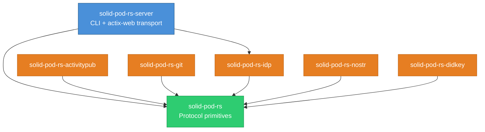
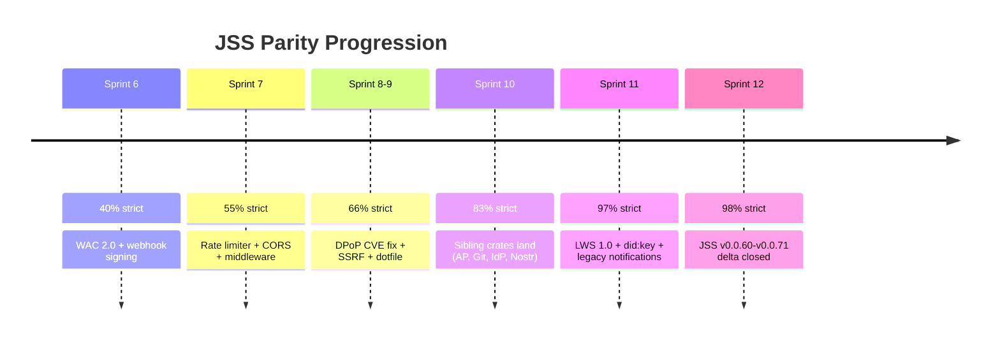

# solid-pod-rs

**A Rust-native port of [JavaScriptSolidServer](https://github.com/JavaScriptSolidServer/JavaScriptSolidServer) (JSS)** — an extended implementation of the Solid Protocol. This crate delivers the full JSS feature surface (~98% strict parity) as a framework-agnostic Rust library and a drop-in server binary.

[](./LICENSE)
[](https://crates.io/crates/solid-pod-rs)
[](https://docs.rs/solid-pod-rs)
[](https://github.com/dreamlab-ai/solid-pod-rs/actions/workflows/ci.yml)
[](https://releases.rs/docs/1.75.0/)

> **Upstream:** [JavaScriptSolidServer (JSS)](https://github.com/JavaScriptSolidServer/JavaScriptSolidServer) — the AGPL-3.0 reference implementation of the [Solid Protocol](https://solidproject.org/TR/protocol).
> This crate is a Rust port of JSS; see the upstream repo for the canonical feature set, issue tracker, and protocol discussion.

---

## What is Solid?

**Solid** (Social Linked Data) is a W3C specification that gives people control over their own data. Instead of scattering personal information across dozens of siloed apps, Solid stores it in a **pod** — a personal data server that the user owns or chooses. Apps ask the pod for permission to read or write data; the user decides who gets access to what.

The key ideas:

- **Your data stays in your pod.** A to-do app, a calendar, and a social feed can all read from the same storage — with your permission.
- **Apps are decoupled from storage.** You can switch apps without migrating data, because the data format (RDF) and the access rules (WAC) are standardised.
- **Identity is portable.** Your WebID is a URL you control. Log in once, use it everywhere — no platform lock-in.

Solid was incubated by Sir Tim Berners-Lee at MIT (2015–2018) and moved to the W3C Solid Community Group. The spec reached 0.9 in 2021 and 0.11 in 2023. Deployments range from academic data vaults (Flemish government's *MijnBurgerprofiel*) to personal pods on community hosts like solidcommunity.net. JSS (JavaScriptSolidServer) is the oldest open-source pod server and the reference against which conformance tests are written. **solid-pod-rs is JSS, rewritten in Rust.**

<details>
<summary><strong>JSS extensions beyond the core Solid spec</strong></summary>

JSS goes further than the base Solid Protocol in several areas. solid-pod-rs tracks all of these:

- **ActivityPub federation** — JSS can federate with Mastodon, Pleroma, and other fediverse servers. Pods can follow and be followed; posts are delivered via signed HTTP requests (draft-cavage-12 HTTP Signatures).
- **Embedded identity provider** — JSS includes a full Solid-OIDC identity provider (authorization-code flow, DPoP-bound tokens, dynamic client registration, JWKS publication) so operators don't need a separate IdP deployment.
- **Git HTTP backend** — JSS can serve Git repositories over smart HTTP, letting users store and clone code directly from their pod.
- **Nostr integration** — NIP-98 HTTP authentication (Schnorr signatures over secp256k1), did:nostr DID document resolution, and an embedded NIP-01 relay.
- **Passkey and Schnorr SSO** — WebAuthn passkey authentication and NIP-07 Schnorr single sign-on as alternatives to password-based login.
- **did:key support** — Ed25519, P-256, and secp256k1 did:key documents with self-signed JWT verification (LWS 1.0 SSI profile).
</details>

<details>
<summary><strong>JSON-LD primer — why RDF?</strong></summary>

Solid uses **RDF** (Resource Description Framework) as its data model. Every piece of data is a triple: `subject → predicate → object`. For example:

```
<#me> <http://xmlns.com/foaf/0.1/name> "Alice" .
```

This is written in **Turtle** syntax. The same triple in **JSON-LD** looks like:

```json
{
  "@id": "#me",
  "http://xmlns.com/foaf/0.1/name": "Alice"
}
```

JSON-LD is JSON with a `@context` that maps short keys to full IRIs. Apps can consume JSON-LD as plain JSON and ignore the RDF layer entirely — or process the full graph if they need to reason across datasets.

ACL (Access Control List) documents use JSON-LD to express who can read, write, or control a resource. The WAC (Web Access Control) spec standardises the vocabulary (`acl:agent`, `acl:agentClass`, `acl:mode`, `acl:default`).
</details>

<details>
<summary><strong>DID:nostr — identity from a cryptographic keypair</strong></summary>

A **DID** (Decentralized Identifier) is a URL that resolves to a document describing a public key and how to verify signatures from it. `did:nostr` maps a Nostr public key (32-byte hex, secp256k1) to a DID document:

```
did:nostr:ab12cd34...  →  resolves to a DID Document with:
  - verificationMethod: Schnorr/secp256k1
  - alsoKnownAs: https://pod.example/profile/card#me  (cross-verified WebID)
```

This bridges the Nostr identity ecosystem with Solid's WebID system. A Nostr user can authenticate to a Solid pod using their existing keypair (NIP-98), and the pod resolves their identity through the did:nostr → WebID `alsoKnownAs` chain.

solid-pod-rs implements both Tier 1 (pubkey → DID Document) and Tier 3 (DID → WebID cross-verification via `alsoKnownAs`/`owl:sameAs`) resolution.
</details>

---

## Quick start

### As a server binary

```bash
cargo install solid-pod-rs-server

# Minimal config — one JSON file.
cat > config.json <<'EOF'
{
  "server": { "host": "127.0.0.1", "port": 3000 },
  "storage": { "kind": "fs", "root": "./pod-root" },
  "auth":    { "nip98": { "enabled": true } }
}
EOF

solid-pod-rs-server --config config.json
```

```bash
# Round-trip a resource.
curl -i -X PUT http://127.0.0.1:3000/notes/hello.ttl \
     -H 'Content-Type: text/turtle' \
     --data-binary '<#> <http://example.org/says> "Hello, Solid".'

curl -i http://127.0.0.1:3000/notes/hello.ttl
# 200 OK
# ETag: "sha256-..."
# Link: <.acl>; rel="acl", <http://www.w3.org/ns/ldp#Resource>; rel="type"
```

### As a library

```toml
[dependencies]
solid-pod-rs = { version = "0.4.0-alpha.1", features = ["fs-backend", "oidc"] }
```

```rust,no_run
use solid_pod_rs::storage::fs::FsBackend;
use std::path::PathBuf;

let storage = FsBackend::new(PathBuf::from("./pod-root"));
// Wire your HTTP framework of choice; see examples/embed_in_actix.rs.
```

All configuration keys accept either a JSON file entry or a `JSS_*` environment variable. See [`docs/reference/env-vars.md`](crates/solid-pod-rs/docs/reference/env-vars.md) for the full list.

---

## Crates

solid-pod-rs is a Cargo workspace of 7 crates. The core library is framework-agnostic; sibling crates add bounded-context features.

| Crate | docs.rs | Description |
|-------|---------|-------------|
| [`solid-pod-rs`](https://crates.io/crates/solid-pod-rs) | [](https://docs.rs/solid-pod-rs) | Core library — LDP, WAC, WebID, auth, notifications, storage |
| [`solid-pod-rs-server`](https://crates.io/crates/solid-pod-rs-server) | [](https://docs.rs/solid-pod-rs-server) | Drop-in server binary (actix-web + CLI) |
| [`solid-pod-rs-idp`](https://crates.io/crates/solid-pod-rs-idp) | [](https://docs.rs/solid-pod-rs-idp) | Solid-OIDC identity provider |
| [`solid-pod-rs-activitypub`](https://crates.io/crates/solid-pod-rs-activitypub) | [](https://docs.rs/solid-pod-rs-activitypub) | ActivityPub federation + HTTP Signatures |
| [`solid-pod-rs-nostr`](https://crates.io/crates/solid-pod-rs-nostr) | [](https://docs.rs/solid-pod-rs-nostr) | did:nostr resolver + NIP-01 relay |
| [`solid-pod-rs-git`](https://crates.io/crates/solid-pod-rs-git) | [](https://docs.rs/solid-pod-rs-git) | Git HTTP smart-protocol backend |
| [`solid-pod-rs-didkey`](https://crates.io/crates/solid-pod-rs-didkey) | [](https://docs.rs/solid-pod-rs-didkey) | did:key + self-signed JWT verifier |



---

## LDP — Linked Data Platform

Solid pods speak LDP. This means every URL is either a **resource** (a file with RDF metadata) or a **container** (a directory that lists its children). You interact with them using standard HTTP verbs: `GET` to read, `PUT` to create or replace, `POST` to add to a container, `PATCH` to edit in place, `DELETE` to remove, and `COPY` to duplicate resources with their ACL sidecars.

<details>
<summary><strong>Technical detail</strong></summary>

solid-pod-rs implements LDP Basic Containers per Solid Protocol §5.2–§5.3:

- **Content negotiation** — Turtle, JSON-LD, N-Triples (RDF/XML deferred per ADR-053).
- **PATCH** — N3 Patch (with `where` precondition → 412), SPARQL-Update, and JSON Patch (RFC 6902 extension).
- **`Prefer` header** — `return=minimal`, `include=containedIRIs`, `include=membership` (LDP §4.2.2, RFC 7240).
- **Conditional requests** — `If-Match` / `If-None-Match` with strong SHA-256 ETags → 304 / 412.
- **Range requests** — single-range `bytes=N-M` (RFC 7233).
- **Container membership** — `ldp:contains` with server-managed `dcterms:modified`, `stat:size`, `stat:mtime`.
- **Container creation via PUT** — `PUT` with `Link: <ldp:BasicContainer>; rel="type"` creates a container (JSS parity).
- **HTTP COPY** — `Source` header → resource + ACL sidecar duplication.
- **Glob GET** — `GET /folder/*` merges all Turtle resources into a single response (JSS parity).
- **`Updates-Via`** — GET responses include `Updates-Via` WebSocket header for live subscription discovery.
- **`.meta` sidecars** — RDF metadata that travels with the resource.

Modules: `ldp`, `storage::fs`, `storage::memory`, `storage::s3`.
</details>

---

## WAC — Web Access Control

Every resource on a Solid pod is protected by an Access Control List. The ACL specifies who (by WebID) can do what (read, write, append, control). No ACL means no access — deny by default. ACLs inherit from parent containers via `acl:default`, so you can set a policy once at the top and let it cascade.

<details>
<summary><strong>Technical detail</strong></summary>

The WAC evaluator implements the full [WAC spec](https://solidproject.org/TR/wac):

- **Modes** — `acl:Read`, `acl:Write`, `acl:Append`, `acl:Control`. `Write ⊇ Append`.
- **Agent matchers** — `acl:agent` (specific WebID), `acl:agentClass` (`foaf:Agent` = public, `acl:AuthenticatedAgent` = logged in), `acl:agentGroup` (group membership).
- **Inheritance** — walks up the path looking for `.acl` sidecars; `acl:default` propagates to descendants.
- **`acl:origin` enforcement** — feature `acl-origin`. Restricts access by request `Origin` header (WAC §4.3).
- **WAC 2.0 conditions** — `acl:ClientCondition`, `acl:IssuerCondition` with a pluggable `ConditionRegistry`.
- **Parser bounds** — 1 MiB Turtle input cap, 32-level JSON-LD depth cap (CWE-400 DoS hardening).
- **`WAC-Allow` header** — returned on 403 responses per the Solid Protocol transparency requirement.

Modules: `wac::evaluator`, `wac::resolver`, `wac::document`, `wac::origin`, `wac::conditions`.

See [`debug-acl-denials.md`](crates/solid-pod-rs/docs/how-to/debug-acl-denials.md) and [`wac-modes.md`](crates/solid-pod-rs/docs/reference/wac-modes.md).
</details>

---

## Authentication

solid-pod-rs ships two authentication paths. Both produce the same `AuthContext` (identity + granted modes), so WAC evaluation doesn't care which one the client used. You can run one, the other, or both side by side.

**NIP-98** — HTTP authentication over Nostr-signed events. The client signs a per-request event (kind 27235) binding the URL, method, and body hash. No IdP, no client registration, no token exchange — just a cryptographic keypair. This is the simplest path for sovereign-identity deployments.

**Solid-OIDC** — Standards-track Solid identity. Authorization-code flow with PKCE, DPoP-bound tokens (RFC 9449), and dynamic client registration. Use this when you need interop with existing Solid clients and identity providers.

<details>
<summary><strong>Technical detail — NIP-98</strong></summary>

- Always compiled (structural verifier). `nip98-schnorr` feature enables BIP-340 Schnorr signature verification.
- Token: base64-encoded Nostr event in `Authorization: Nostr <token>`.
- Binds: URL (`u` tag), method (`method` tag), body hash (`payload` tag = `SHA-256(body)`).
- Timestamp tolerance: ±60 s. Max token size: 64 KB.
- Identity: pubkey → `did:nostr:{pubkey}`.

Module: `auth::nip98`. See [`configure-nip98-auth.md`](crates/solid-pod-rs/docs/how-to/configure-nip98-auth.md).
</details>

<details>
<summary><strong>Technical detail — Solid-OIDC + DPoP</strong></summary>

- Feature `oidc`. DPoP replay cache under `dpop-replay-cache`.
- DPoP proof verification: algorithm allowlist (`ES256`, `ES384`, `RS256`–`RS512`, `PS256`–`PS512`, `EdDSA`); `alg=none` and HMAC hard-rejected.
- `ath` (access-token hash) binding enforced per RFC 9449 §4.3.
- `jti` replay cache: per-process LRU, bounded, clock-aware, concurrent-safe.
- JWKS discovery: SSRF-guarded, DNS-rebinding-closed, with per-call IP pinning.
- RFC 7638 canonical JWK thumbprints (verified against appendix-A test vector).
- Issuer validation: `verify_access_token` enforces `iss == expected_issuer`.
- WebID extraction: URL-shaped WebIDs only from `webid` or `sub` claim.

Module: `oidc`. See [`enable-solid-oidc.md`](crates/solid-pod-rs/docs/how-to/enable-solid-oidc.md).
</details>

---

## Identity Provider

The `solid-pod-rs-idp` crate is a complete Solid-OIDC identity provider. It handles the full authorization-code flow with PKCE, issues DPoP-bound access tokens signed with ES256, manages dynamic client registration, and publishes JWKS. Operators can run a self-contained pod+IdP without needing a separate identity service.

<details>
<summary><strong>Technical detail</strong></summary>

- **Authorization-code flow** with PKCE (S256). Single-use auth codes. Configurable TTL.
- **DPoP token binding** — `cnf.jkt` = JWK thumbprint of the client's DPoP key. `ath` = SHA-256 of the access token.
- **ES256 signing** — Solid-OIDC mandates ES256 for DPoP. RS256 omitted to avoid pulling `rsa`.
- **Dynamic client registration** — `POST /idp/reg` returns `client_id` + `client_secret`. Client Identifier Documents fetched with SSRF guard.
- **Credentials endpoint** — email + password (argon2id hash). Rate-limited: 10/min per IP.
- **Password validation** — min 8 chars (CWE-521, matches JSS commit `1feead2`).
- **WebAuthn passkeys** — feature `passkey`. Built on `webauthn-rs` 0.5. User-verification required, `EdDSA`+`ES256`.
- **Schnorr SSO** — feature `schnorr-sso`. NIP-07-style challenge-response with 5-minute TTL.
- **Discovery** — `GET /.well-known/openid-configuration` and `GET /.well-known/jwks.json`.
- **Axum binder** — feature `axum-binder` for a pre-built Router with discovery, JWKS, registration, and credentials.

Crate: [`solid-pod-rs-idp`](https://docs.rs/solid-pod-rs-idp). See the [IdP README](crates/solid-pod-rs-idp/README.md) for the full auth-code flow diagram.
</details>

---

## Notifications

When data on a pod changes, subscribed clients need to know. Solid Notifications 0.2 defines the protocol: clients subscribe to a resource and receive events when it's created, modified, or deleted. solid-pod-rs ships three delivery mechanisms.

<details>
<summary><strong>Technical detail</strong></summary>

- **WebSocketChannel2023** — the current Solid Notifications 0.2 protocol. Subscribers `POST` a `NotificationChannel` and receive updates over a topic-bound WebSocket.
- **WebhookChannel2023** — same event model, delivered as outbound HTTP `POST` requests. RFC 9421 Ed25519 signing over `@method`, `@target-uri`, `content-type`, `content-digest`, `date`, `x-solid-notification-id`. Exponential backoff + circuit breaker.
- **Legacy `solid-0.1`** — feature `legacy-notifications`. Compatibility adapter for SolidOS data browser's older WebSocket dialect with WAC read-check on subscribe.
- Events are generated from storage-layer mutations via a `NotificationBus`. Custom backends emit events by calling `publish`.

Modules: `notifications::websocket`, `notifications::webhook`, `notifications::legacy`.
</details>

---

## ActivityPub Federation

Pods can participate in the fediverse. The `solid-pod-rs-activitypub` crate implements ActivityPub Actor discovery, inbox processing with HTTP Signature verification, outbox emission with follower fan-out, and a SQLite-backed persistence layer for followers, activities, and the delivery queue.

<details>
<summary><strong>Technical detail</strong></summary>

- **Actor documents** — Accept-negotiation between `application/activity+json` and LDP profiles.
- **Inbox** — `POST /inbox` with draft-cavage-12 HTTP Signature verification (RSA-SHA256). SHA-256 `Digest` header validation.
- **Outbox** — raw Notes auto-wrapped in `Create` activities. UUID IDs, ISO 8601 timestamps. Follower fan-out delivery.
- **Delivery** — HTTP Signature signing, exponential retry (5xx), no retry on 4xx. `enqueue_to_inboxes()` batch helper.
- **Store** — SQLite via `sqlx`. Tables: followers, following, inbox, outbox, delivery queue. Actor cache with 24-hour freshness.
- **Discovery** — NodeInfo 2.1 document emission. WebFinger JRD rendering.

Crate: [`solid-pod-rs-activitypub`](https://docs.rs/solid-pod-rs-activitypub). See the [AP README](crates/solid-pod-rs-activitypub/README.md) for the federation flow diagram.
</details>

---

## Storage Backends

The `Storage` trait abstracts the blob + metadata layer. The rest of the crate is backend-agnostic — LDP, WAC, notifications all work identically regardless of where bytes are stored.

<details>
<summary><strong>Technical detail</strong></summary>

- **`fs-backend`** (default) — POSIX filesystem. Sidecar `.meta` and `.acl` documents. Atomic rename for concurrent writers. Path traversal guard (`..` and `\0` rejection).
- **`memory-backend`** (default) — in-process `HashMap`. Tests, demos, ephemeral deployments.
- **`s3-backend`** (opt-in) — AWS S3 and S3-compatible stores (MinIO, R2, Backblaze B2). Metadata in object tags.
- **Custom backends** — implement `get`, `put`, `delete`, `list` on `ResourceMeta` + `Bytes`. See [`custom_storage.rs`](crates/solid-pod-rs/examples/custom_storage.rs).
- **Quota** — feature `quota`. Per-pod `.quota.json` sidecar with atomic writes. `JSS_DEFAULT_QUOTA` env var.

Modules: `storage::fs`, `storage::memory`, `storage::s3`, `quota`.
</details>

---

## Security

solid-pod-rs is designed to be safe by default. The library rejects paths containing `..` or null bytes, blocks SSRF against private IP ranges and cloud metadata endpoints, enforces size limits on ACL documents, and denies access when no ACL is found.

<details>
<summary><strong>Technical detail</strong></summary>

- **SSRF guard** — blocks RFC 1918, loopback, link-local, cloud metadata (169.254.169.254), and DNS resolution failures. Per-call IP pinning closes DNS-rebinding.
- **Dotfile allowlist** — only `.acl`, `.meta`, `.well-known`, `.quota.json`, `.account` are served. All other dotfiles return 404.
- **Path traversal** — both backends reject `..` and `\0` in `normalize`. Double-encoded traversal (`%252e%252e`) caught by the server middleware.
- **ACL parser bounds** — 1 MiB Turtle cap (`JSS_MAX_ACL_BYTES`), 32-level JSON-LD depth cap. Returns `PodError::PayloadTooLarge`.
- **Token size limit** — NIP-98 tokens > 64 KB rejected before parsing.
- **Password validation** — 8-char minimum (CWE-521).
- **Atomic quota writes** — temp-file + rename prevents torn `.quota.json`.
- **Webhook signing** — RFC 9421 Ed25519 over method, target-uri, content-type, content-digest, date, notification-id.

See [`SECURITY.md`](crates/solid-pod-rs/SECURITY.md) and the full [`security-model.md`](crates/solid-pod-rs/docs/explanation/security-model.md).
</details>

---

## Configuration

The server binary loads configuration in layers (lowest precedence first): compiled-in defaults → JSON/TOML config file → `JSS_*` environment variables. The variable names are identical to JSS so existing deployment scripts, Kubernetes manifests, and Docker Compose files work unchanged.

<details>
<summary><strong>Technical detail</strong></summary>

| Variable | Type | Purpose |
|----------|------|---------|
| `JSS_HOST` | string | Bind address (default `127.0.0.1`) |
| `JSS_PORT` | u16 | Listen port (default `3000`) |
| `JSS_BASE_URL` | URL | Externally visible base URL |
| `JSS_STORAGE_ROOT` | path | Filesystem root (FS backend) |
| `JSS_OIDC_ISSUER` | URL | Identity provider discovery URL |
| `JSS_WORKERS` | usize | actix-web worker count (default: CPU count) |
| `JSS_LOG_LEVEL` | string | `trace` / `debug` / `info` / `warn` / `error` |
| `JSS_MAX_ACL_BYTES` | usize | ACL document size cap (default 1 MiB) |
| `JSS_MAX_REQUEST_BODY` | string | Request body cap (e.g. `50MB`) |
| `JSS_DEFAULT_QUOTA` | string | Per-pod storage quota |

Full list: [`docs/reference/env-vars.md`](crates/solid-pod-rs/docs/reference/env-vars.md).
</details>

---

## Account Management

The server exposes the same account management endpoints as JSS, so existing Solid clients and deployment tooling work without modification. Pods are provisioned with a full directory structure: WebID profile, inbox, public/private containers, type indexes, and root ACL.

<details>
<summary><strong>Technical detail</strong></summary>

| Endpoint | Method | Purpose |
|----------|--------|---------|
| `/api/accounts/new` | POST | Create a new pod (username + optional display name) |
| `/pods/check/{name}` | GET | Check if a pod name is taken |
| `/login/password` | POST | Credentials login (delegates to IdP crate) |
| `/account/password/reset` | POST | Request password reset (anti-enumeration: always 200) |
| `/account/password/change` | POST | Change password with reset token |
| `/.well-known/solid` | GET | Discovery document with `api.accounts.*` URLs |

Pod provisioning creates: `/profile/card` (WebID), `/inbox/`, `/public/`, `/private/`, `/settings/`, `publicTypeIndex.jsonld`, `privateTypeIndex.jsonld`, and root `.acl`.
</details>

---

## Feature Flags

Feature flags keep the dependency surface tight. A minimal NIP-98-only build is under 200 KB of transitive deps; a full build stays under 40 MB.

| Flag | Default | Purpose |
|------|:-------:|---------|
| `fs-backend` | on | POSIX filesystem storage |
| `memory-backend` | on | In-process `HashMap` storage (tests/demos) |
| `s3-backend` | off | AWS S3 / S3-compatible object stores |
| `oidc` | off | Solid-OIDC 0.1 + DPoP |
| `dpop-replay-cache` | off | DPoP `jti` replay cache (pulls `oidc`) |
| `nip98-schnorr` | off | BIP-340 signature verification for NIP-98 |
| `acl-origin` | off | WAC `acl:origin` enforcement |
| `security-primitives` | off | SSRF guard + dotfile allowlist |
| `legacy-notifications` | off | `solid-0.1` WebSocket adapter (SolidOS) |
| `config-loader` | off | Layered config loader with `JSS_*` env vars |
| `webhook-signing` | off | RFC 9421 Ed25519 webhook signing |
| `did-nostr` | off | did:nostr resolver in `interop` |
| `rate-limit` | off | Sliding-window LRU rate limiter |
| `quota` | off | Per-pod `.quota.json` sidecar |

---

## Parity with JSS

solid-pod-rs has reached ~98% strict parity with JSS: 0 rows missing on the 132-row tracker, 5 explicitly deferred as legacy/P3, 4 wontfix-in-crate as consumer concerns. The Rust port adds runtime advantages on top of feature parity: no Node.js dependency, single static binary, lower memory footprint, deterministic RDF serialisation, and compile-time feature gating.



See the full row-by-row accounting in [`PARITY-CHECKLIST.md`](crates/solid-pod-rs/PARITY-CHECKLIST.md) and the prose gap analysis in [`GAP-ANALYSIS.md`](crates/solid-pod-rs/GAP-ANALYSIS.md).

---

## Lineage and Licence

solid-pod-rs is a Rust port of [JavaScriptSolidServer](https://github.com/JavaScriptSolidServer/JavaScriptSolidServer) and deliberately inherits JSS's AGPL-3.0 licence to preserve the ecosystem's network-service copyleft.

```
JavaScriptSolidServer (Node.js, AGPL-3.0)
        │
        ├── reference implementation
        │
solid-pod-rs (Rust, AGPL-3.0)   ← you are here
```

**AGPL-3.0-only.** If you operate solid-pod-rs as a network-accessible service — which, by the nature of a pod, you almost certainly will — §13 of the AGPL requires you to provide corresponding source to your users. See [`LICENSE`](LICENSE) and [`NOTICE`](crates/solid-pod-rs/NOTICE).

---

## Documentation

Full documentation follows the [Diataxis](https://diataxis.fr/) framework in [`crates/solid-pod-rs/docs/`](crates/solid-pod-rs/docs/):

- **Tutorials** — learning-oriented walkthroughs for new users
- **How-to guides** — goal-oriented recipes (configure auth, enable notifications, debug ACL denials)
- **Reference** — exhaustive API docs, env vars, WAC modes, agent integration guide
- **Explanation** — architecture decisions, security model, design rationale

---

## Contributing

See [`CONTRIBUTING.md`](crates/solid-pod-rs/CONTRIBUTING.md). Run `cargo test --all-features` and `cargo clippy --all-targets --all-features -- -D warnings` before opening a pull request. Security issues: follow [`SECURITY.md`](crates/solid-pod-rs/SECURITY.md).
