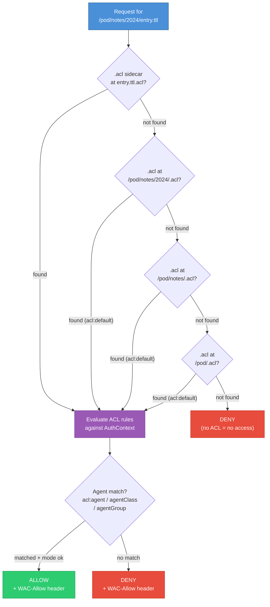

# solid-pod-rs

Framework-agnostic Rust library for serving [Solid Protocol 0.11]
pods: LDP resources and containers, Web Access Control, WebID,
Solid Notifications 0.2, Solid-OIDC 0.1, and NIP-98 HTTP auth.

**Parity vs JSS: ~100 % spec-normative** (~98 % strict on the full
132-row tracker — see [`PARITY-CHECKLIST.md`](PARITY-CHECKLIST.md)).
702 tests pass across the workspace as of Sprint 12 close (2026-05-06).

The library has no opinions about the HTTP runtime; wire it into
actix-web, axum, hyper, or any other server. For a turnkey binary
use the sibling crate [`solid-pod-rs-server`](../solid-pod-rs-server/).

```toml
[dependencies]
solid-pod-rs = "0.5.0-alpha.0"
```

```rust,no_run
use solid_pod_rs::storage::fs::FsBackend;
use std::path::PathBuf;

let storage = FsBackend::new(PathBuf::from("./pod-root"));
// Compose with your framework; see examples/embed_in_actix.rs.
```

## What's new in 0.5.0-alpha.0 (2026-06-13, provenance primitives — ADR-059)

Two composable, cost-tiered **provenance primitives** become first-class, giving
the pod **verifiable, tamper-evident traceability** over every change to its
data, plus a sovereign, Bitcoin-settled trust ledger beneath it. See
[ADR-059](docs/adr/ADR-059-provenance-primitives-block-trails-git-marks.md) and
the [master plan](docs/design/provenance-upgrade-master-plan.md).

- **git-marks** (cheap, always-on) — every LDP write (`PUT`/`POST`/`PATCH`)
  becomes a git commit, captured as a `GitMark` and persisted as a PROV-O
  sidecar at `<resource>.prov.ttl`. Content-addressed, append-only,
  tamper-evident ordering of every write — and a queryable history of who wrote
  what. Module `provenance`; native `GitMarker` in `solid-pod-rs-git`, no-op on
  wasm.
- **block-trails** (high-value, opt-in, feature `mrc20`) — a Bitcoin-taproot
  -anchored, hash-chained MRC20 state trail. Verify **and** write side
  (`bitcoin_tx.rs`: P2TR build, BIP-341 TapSighash, BIP-340 Schnorr signing) —
  byte-parity with JSS `token.js`, validated against the official BIP-340/341
  vectors. One instance of a general `ProvenanceTrail`; the payment token is
  another. Anchors run against **testnet4** via the public mempool API by
  default.
- **composition** — `ProvenanceLog` records a git-mark on every write and adds a
  Bitcoin anchor only when an ACL carries `acl:ProvenanceAnchor` or the record is
  high-value. An **epoch Merkle root** batches many commits so one tx notarises
  an entire epoch. New `_prov` routes: `GET /{pod}/{path}.prov.ttl`,
  `GET /{pod}/_prov/{commit_sha}`, `POST /{pod}/_prov/anchor`.
- **economy + hardening** — the routed web-ledger / order-book / AMM 402 economy
  with replay protection (`PaymentStore` the sole ledger I/O), and WAC-gated git
  smart-HTTP closing the anonymous-push hole.

## What's new in 0.4.0-alpha.15 (2026-05-30, JSS v0.0.204 sync)

Integrates the upstream JSS delta `0.0.197` (`10bd60f`) → `0.0.204`
(`9d29167`): an agent-facing Model Context Protocol surface, an app
distribution CLI, and two content-type / listing fixes.

- **MCP server** (`solid-pod-rs-server`, JSS #490): `POST /mcp` exposes
  the pod as a Model Context Protocol 2025-03-26 tool surface (sixteen
  tools, JSON-RPC 2.0, SSE upgrade for `subscribe`). Identity reuses the
  NIP-98 verifier, so tool calls get the same WAC treatment as REST. Off
  by default (`--mcp` / `JSS_MCP`).
- **`install` subcommand** (`solid-pod-rs-server`): clones a Solid app and
  pushes it into a pod over git smart HTTP, authenticating with a single
  NIP-98 `http.extraHeader` token. Requires the `install` cargo feature
  for NIP-98 signing.
- **NIP-98 token minting** (`auth::nip98::mint`, feature `nip98-schnorr`)
  and **`MatchPolicy`** (`Strict` for REST/MCP, `GitLenient` for the git
  push bridge — `*`-method wildcard + repo-URL-prefix binding).
- **`ldp::guess_content_type`** (JSS #533): MIME fallback for
  sidecar-absent resources, so git-extracted app files render inline.
- **Fixes**: symlinked-directory container listing (JSS #531) and the
  mashlib `audio/*` rendering family (JSS #533).

## What's new in 0.4.0-alpha.11 (2026-05-16, JSS Phase 1 port)

Three default-off feature flags add the JSS Phase 1 surface (issue
#437) — pod-resident identity, federated NIP-05, and JSON-LD data
export. ABI shapes scaffolded in alpha.10 are preserved; downstream
crates (NRF, dreamlab-ai-website) opt in via feature flags without
source changes.

- `provision-keys` (in `solid-pod-rs-idp`): BIP-340 Schnorr keypair
  generation, NIP-19 bech32 encoding, owner-only ACL, and WebID
  patching with `nostr:pubkey`.
- `nip05-endpoint` (in `solid-pod-rs` + `solid-pod-rs-server`):
  `GET /.well-known/nostr.json?name=<local>` resolved from the pod's
  WebID JSON-LD island.
- `export-jsonld` (in `solid-pod-rs`): pod-tree export bundle with
  `@context = "https://solid-pod-rs.dev/ns/export/v1"`, ordered
  ascending by `created`, `/private/*` excluded unless opted in.

CF-Workers portability of these three modules is tracked upstream in
[NRF ADR-087](https://github.com/DreamLab-AI/nostr-rust-forum/blob/main/docs/adr/ADR-087-cf-workers-portable-cores.md);
a small WAC Turtle serializer quirk is tracked in
[NRF ADR-088](https://github.com/DreamLab-AI/nostr-rust-forum/blob/main/docs/adr/ADR-088-wac-turtle-serializer.md).

## Feature flags

| Flag                    | Default | Purpose                                       |
|-------------------------|:-------:|-----------------------------------------------|
| `fs-backend`            | on      | POSIX filesystem storage.                     |
| `memory-backend`        | on      | In-process `HashMap` storage (tests/demos).   |
| `s3-backend`            | off     | AWS S3 / S3-compatible object stores.         |
| `oidc`                  | off     | Solid-OIDC 0.1 + DPoP.                        |
| `dpop-replay-cache`     | off     | DPoP `jti` replay cache (pulls `oidc`).       |
| `nip98-schnorr`         | off     | BIP-340 Schnorr signature verification for NIP-98 via `verify_raw()` (raw 32-byte message, no tagged pre-hash). |
| `acl-origin`            | off     | WAC `acl:origin` enforcement.                 |
| `security-primitives`   | off     | SSRF guard + dotfile allowlist.               |
| `legacy-notifications`  | off     | `solid-0.1` WebSocket adapter (SolidOS).      |
| `config-loader`         | off     | Layered config loader with `JSS_*` env vars.  |
| `webhook-signing`       | off     | RFC 9421 Ed25519 webhook signing.             |
| `did-nostr`             | off     | did:nostr resolver in `interop`.              |
| `mrc20`                 | off     | Bitcoin block-trail anchors + taproot tx build/sign (BIP-340/341). |
| `rate-limit`            | off     | Sliding-window LRU rate limiter.              |
| `quota`                 | off     | Per-pod `.quota.json` sidecar (atomic writes).|

## Modules

| Module          | Responsibility                                               |
|-----------------|--------------------------------------------------------------|
| `storage`       | `Storage` trait + FS / Memory / S3 backends.                 |
| `ldp`           | Resources, containers, content negotiation, PATCH, `Prefer`. |
| `wac`           | Access control evaluator + WAC 2.0 conditions framework.     |
| `webid`         | WebID profile documents (emits `solid:oidcIssuer` + CID).    |
| `mashlib`       | SolidOS data-browser HTML wrapper + data-island optimisation.|
| `auth`          | NIP-98 HTTP authentication.                                  |
| `oidc`          | Solid-OIDC 0.1 + DPoP (verified) + JWKS + replay cache.      |
| `notifications` | WebSocket, Webhook (RFC 9421 signed), legacy adapter.        |
| `security`      | SSRF guard + dotfile allowlist + CORS + rate limiter.        |
| `quota`         | Per-pod `.quota.json` sidecar with atomic writes.            |
| `provenance`    | git-marks + block-trail anchors; `ProvenanceLog`, PROV-O sidecars, epoch Merkle batching. |
| `payments`      | HTTP 402 web ledger, deposits, order book + AMM (Bitcoin-settled). |
| `mrc20`         | Taproot MRC20 state trail (verify) + `bitcoin_tx` (build/sign). |
| `multitenant`   | `PodResolver` trait; path + subdomain modes.                 |
| `config`        | Layered configuration schema.                                |
| `interop`       | `.well-known/solid`, WebFinger, NodeInfo 2.1, did:nostr.     |
| `provision`     | Pod bootstrap (WebID + containers + type indexes + ACL).     |

## Sibling crate ecosystem

Five sibling crates live in the workspace — all **functional and
shipping** as of Sprint 12. Integrators may depend on them today.

| Crate                      | LOC   | Parity rows            | JSS source refs                     |
|----------------------------|-------|------------------------|-------------------------------------|
| `solid-pod-rs-activitypub` | 4,453 | 102–108, 131, 169–172  | `src/ap/{index,routes/inbox,routes/outbox,store}.js` |
| `solid-pod-rs-git`         | 1,685 | 69, 100                | `src/handlers/git.js`               |
| `solid-pod-rs-idp`         | 6,160 | 74–81, 130             | `src/idp/{index,provider,passkey,interactions,credentials}.js` |
| `solid-pod-rs-nostr`       | 2,177 | 89, 90, 101, 132       | `src/{did/resolver,nostr/relay,auth/did-nostr}.js`  |
| `solid-pod-rs-didkey`      | 1,167 | 153                    | W3C did:key spec + LWS 1.0 SSI     |

The did:nostr resolver shipped in Sprint 6 lives inside the core
library (`interop::did_nostr` under `did-nostr`) as well as the
`solid-pod-rs-nostr` crate, so the Tier 1 + Tier 3 DID flow is
available either way.

## WAC inheritance model



## Security posture

- **DPoP signature verification** against the proof's embedded JWK
  (RFC 9449 §4.3), with an algorithm allowlist (`ES256`/`ES384`,
  `RS256`/`RS384`/`RS512`, `PS256`/`PS384`/`PS512`, `EdDSA`); `alg=none`
  and HMAC hard-rejected. `ath` access-token hash binding enforced.
  `jti` replay cache under `dpop-replay-cache`.
- **SSRF guard** — RFC 1918, loopback, link-local, and cloud metadata
  endpoints are rejected on every outbound fetch (JWKS discovery,
  webhook delivery, did:nostr resolution). DNS-rebinding is closed by
  pinning the resolved IP on the per-call reqwest client.
- **Dotfile allowlist** — only `.acl`, `.meta`, `.well-known`,
  `.quota.json`, and `.account` are served. All other dotfiles return
  404 regardless of storage-layer presence.
- **RFC 7638 canonical JWK thumbprints** — replaces the previous
  hand-rolled JSON template; verified byte-for-byte against the
  spec's appendix-A vector.
- **WAC parser bounds** — 1 MiB Turtle input cap via
  `parse_turtle_acl_with_limit` (`JSS_MAX_ACL_BYTES`); 32-level
  JSON-LD depth cap via `parse_jsonld_acl_with_limits`. Returns
  `PodError::PayloadTooLarge` on oversized input (CWE-400, Sprint 12).
- **Atomic quota writes** — temp-file + rename so concurrent writers
  cannot observe a torn `.quota.json`.
- **RFC 9421 webhook signing** — Ed25519 over `@method`,
  `@target-uri`, `content-type`, `content-digest` (RFC 9530),
  `date`, `x-solid-notification-id`.

See [`SECURITY.md`](SECURITY.md) for disclosure policy and a full
cryptographic verification matrix.

## Documentation

- Workspace README: [`../../README.md`](../../README.md)
- Diátaxis docs: [`docs/`](docs/)
- Agent integration guide: [`docs/reference/agent-integration-guide.md`](docs/reference/agent-integration-guide.md)
- Parity vs JSS: [`PARITY-CHECKLIST.md`](PARITY-CHECKLIST.md)
- Gap analysis: [`GAP-ANALYSIS.md`](GAP-ANALYSIS.md)
- Changelog: [`CHANGELOG.md`](CHANGELOG.md)

## Licence

AGPL-3.0-only — see [`../../LICENSE`](../../LICENSE) and
[`NOTICE`](NOTICE).

[Solid Protocol 0.11]: https://solidproject.org/TR/protocol
