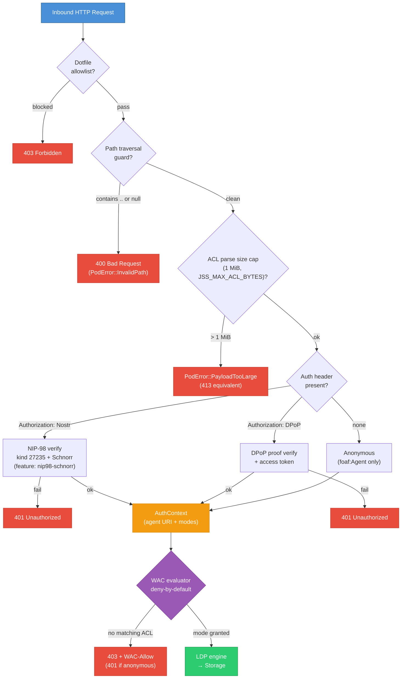

# Security model

This page describes the threat model solid-pod-rs is built to defend
against, the controls the crate provides, and what remains the
integrator's responsibility.

## Scope

We defend against:

- Unauthenticated access to non-public resources.
- Authenticated-but-unauthorised access (WAC).
- Token replay (both NIP-98 and DPoP-bound OIDC).
- Path traversal / escape in storage backends.
- Request tampering when the embedding transport supplies the raw body to the
  verifier. The core verifier supports this, but the bundled server currently
  omits it; see AUD-010 in the dated audit.

We **do not** uniformly defend against:

- TLS termination weaknesses — that's the reverse proxy's job.
- Application-layer rate limiting. Selected endpoints have local limiters,
  but this is not a server-wide invariant.
- Denial of service from oversized responses or subprocess output. Request
  body limits exist, but the proxy and git CGI paths currently buffer output;
  see the [2026-08-19 audit](../reference/security-audit-2026-08-19.md).
- OS-level integrity — if an attacker can write to `$POD_FS_ROOT`
  directly, they own the pod regardless of what the library does.

## Auth layering

Two layers, independent, stackable:

> Schnorr signature verification of NIP-98 events is feature-gated behind
> `nip98-schnorr` (without it only structural checks run); the bundled
> `solid-pod-rs-server` binary gets it transitively via its
> `solid-pod-rs-idp` dependency. The DPoP lane is provided by the core
> crate's `oidc` feature for embedders — the bundled server wires only the
> NIP-98 lane into its request path (it advertises `DPoP`/`Bearer` in
> `WWW-Authenticate`) as of 2026-06-12.

### Layer 1 — Request authentication

Either NIP-98 or Solid-OIDC DPoP. Both produce:

- A verified identity token (pubkey or WebID).
- A bound URL + method + optional body hash.

Characteristics:

| Property                        | NIP-98                          | Solid-OIDC DPoP                 |
|---------------------------------|---------------------------------|---------------------------------|
| Transport                       | HTTP `Authorization: Nostr …`   | HTTP `Authorization: DPoP …` + `DPoP: …` |
| Event / token format            | Nostr kind 27235 event, base64  | JWT access token + DPoP proof JWT |
| Signature algorithm             | BIP-340 Schnorr over secp256k1 via `verify_raw` (raw 32-byte message, no tagged pre-hash) | ES256 / RS256 (access token + DPoP proof) |
| Binds URL                       | `u` tag                         | `htu` claim (DPoP proof)        |
| Binds method                    | `method` tag                    | `htm` claim                     |
| Binds body                      | Core verifier checks `payload = SHA-256(body)` when its caller supplies the body; the bundled server currently does not | Access-token handling; proof's `ath` if applicable |
| Timestamp tolerance             | ±60 s                           | Configurable `skew` (default 60 s) |
| Key-to-identity                 | pubkey → `did:nostr:{pubkey}`   | DPoP thumbprint bound via `cnf.jkt` |
| Anti-replay                     | Main server adds an event-id cache; forge currently uses only the timestamp window | `jti` nonce cache (consumer-crate concern) |

Both layers produce an `agent_uri` string that feeds the WAC evaluator.

> **Binder trust boundary:** the optional IdP Axum router does not install
> authentication middleware. Its password-change and account-delete handlers
> trust `X-Authenticated-User`. Never expose that router directly; strip the
> header at the edge and inject it only after session/token verification. This
> unsafe default is tracked as AUD-001 in the
> [2026-08-19 audit](../reference/security-audit-2026-08-19.md).

> **MCP boundary:** keep MCP disabled on this release. The optional MCP surface
> contains a reproduced anonymous arbitrary-read path and generic resource
> operations that do not elevate ACL sidecars to `acl:Control`; see AUD-009.

### Layer 2 — WAC authorisation

Ordinary LDP requests are filtered by `wac::evaluate_access`. Special-purpose
routes have their own gates; they are not all equivalent, and AUD-002/AUD-009
document current exceptions. The WAC evaluator:

- Walks up the tree looking for `.acl` sidecars.
- Parses JSON-LD authorizations.
- Checks agent matchers (`acl:agent`, `acl:agentClass`,
  `acl:agentGroup`).
- Checks mode (`acl:Read`, `Write`, `Append`, `Control`) with the
  single implication rule: `Write ⇒ Append`.
- Returns a boolean.

Deny-by-default: no ACL, no access.

## NIP-98 threat cases

### Token replay at a different URL

Mitigated. The `u` tag must match the canonical URL (trailing-slash
normalised). A token minted for `/profile/card` is rejected at
`/public/secrets`.

### Token replay at a different method

Mitigated. The `method` tag must match.

### Token replay with a modified body

Mitigated by the core verifier only when its caller supplies the raw body. The
bundled server calls it with `None`, so ordinary REST, payment, proxy, and MCP
authentication does not currently enforce the signed payload tag. This is
AUD-010 and must be fixed before relying on NIP-98 for request integrity.

### Token replay in the future

The main server supplements the 60-second window with a canonical event-id
replay cache. The forge resolver calls the stateless verifier directly and
does not use that cache (AUD-012). Clocks must be synchronised.

### Enlarged token to exhaust the server

Mitigated by `MAX_EVENT_SIZE = 64 KB`. Tokens larger than this (pre-
or post-base64-decode) are rejected without parsing.

### Non-standard kind

Mitigated. `kind != 27235` → rejected.

### Invalid pubkey format

Mitigated. 64 hex chars required; non-hex rejected.

## Solid-OIDC threat cases

### Bearer-token theft

Mitigated *at the protocol level* by DPoP: the client must prove
possession of the keypair whose thumbprint appears in the access
token's `cnf.jkt`. A stolen access token without the DPoP key is
useless.

### DPoP proof replay at a different URL / method

Mitigated. `htu` and `htm` claims are checked against the actual
request.

### DPoP proof replay in time

Mitigated by `iat` skew. We do not implement a jti nonce cache —
consumers that need stronger replay protection should add one in
middleware.

### Access-token substitution

Mitigated by issuer validation — `verify_access_token` enforces
`iss == expected_issuer`.

### WebID impersonation

Mitigated. `extract_webid` only accepts URL-shaped WebIDs from either
the `webid` claim (explicit) or the `sub` claim (fallback). Non-URL
`sub` values are rejected.

## WAC threat cases

### Modifying `.acl` without authorisation

`.acl` is a resource like any other, gated by the ACL effective for
**its own path**. Convention: granting `acl:Control` on a resource
permits writing its `.acl` sidecar. Our example server does not
special-case `.acl` writes — the HTTP layer must check
`AccessMode::Control` when the request URI ends in `.acl`.

### Walking up past the pod root

The resolver walks from the resource path up to `/`. It terminates at
`/`. There is no way to escape to the host filesystem.

### ACL document injection

`StorageAclResolver::find_effective_acl` silently ignores
deserialisation failures (treats them as "no ACL found"). This is the
safer default — a corrupted ACL must not accidentally grant access.
A noisier mode that raises `AclParse` would invite
denial-of-service via deliberately broken ACL documents.

## Storage threat cases

### Path traversal via `..`

Both built-in backends reject paths containing `..` or `\0` in
`normalize`. Custom backends **must** do the same.

### Path traversal via URL encoding

URL decoding happens in the HTTP framework, before solid-pod-rs sees
the path. Ensure the framework's URL-decoder is correct (actix-web,
axum, and hyper all handle this).

### Symlink escape (FS backend)

The `FsBackend::resolve` path check (`full.starts_with(root)`) is lexical and
does not contain symlinks. The audit reproduced reading a host file through a
symlink inside the pod root; writes follow the same OS resolution. Git-backed
pods can materialise symlinks from tenant-controlled repositories, turning
this into a tenant-to-host boundary rather than merely an OS-admin concern.
Treat the FS backend as unsafe for mutually untrusted tenants until AUD-013 is
fixed. Least-privilege service credentials reduce impact but are not a fix.

### Concurrent mutation

Both backends are `Send + Sync` and use appropriate synchronisation.
Custom backends must preserve "either old or new state, never mid-
write" semantics for `put`.

## Sprint 12 security additions

### Size-capped ACL parsing (CWE-400)

`parse_turtle_acl_with_limit(input, max_bytes)` and
`parse_jsonld_acl_with_limits(body, max_bytes, max_depth)` reject
oversized ACL documents before parsing begins. The default cap is 1 MiB
(`MAX_ACL_BYTES`), tunable via `JSS_MAX_ACL_BYTES`. Rejection returns
`PodError::PayloadTooLarge`. This matches JSS's `safeJsonParse` pattern
which limits JSON body parsing to prevent memory-exhaustion DoS.

### `.account` dotfile allowlist entry

The `.account` dotfile is now permitted through the dotfile filter,
matching JSS commit `32c0db2`. This allows the IdP login endpoint at
`/.account/…` to serve account-related resources (login, registration,
password reset). Added to both `DEFAULT_ALLOWED` (struct-based) and
`STATIC_ALLOWED_DOTFILES` (free-function) allowlists, plus the config
schema's `default_dotfile_allowlist()`.

### Password-length validation (CWE-521)

The `solid-pod-rs-idp` crate enforces a minimum password length of 8
characters (matching JSS commit `1feead2`). `validate_password_length()`
is available as a standalone helper. Enforcement occurs at both
login (`LoginError::PasswordTooShort → HTTP 400`) and registration
(`UserStoreError::PasswordTooShort`) time.

### DNS resolution failure blocking

The SSRF guard blocks hosts that fail DNS resolution as defence-in-depth.
Hostnames under RFC 6761 reserved TLDs (e.g. `.invalid`) are blocked
rather than silently passed through. This prevents SSRF bypass via
attacker-controlled DNS records that point to internal IPs after initial
resolution.

## What integrators must add

### HTTP-layer hardening

- TLS termination with a strong cipher suite (TLS 1.3 only when
  possible).
- Body-size limits on every method (both NIP-98 limit ≤ 64 KB for
  the *token*; the *body* itself should be bounded realistically).
- Rate limiting per identity (not per IP — authenticated identity is
  the natural axis).
- Short request timeouts (PATCH blocks can pathologically evaluate).

### DPoP jti cache

Solid-OIDC DPoP nominally requires a short-TTL cache of seen `jti`
values to make replay protection strict. solid-pod-rs doesn't ship
one — it's a deployment concern (you choose Redis, in-memory, local
LRU).

### WebID-OIDC issuer trust

If you accept arbitrary OIDC issuers (not a single one), implement an
issuer allow-list. The crate's `verify_access_token` takes a single
`expected_issuer` argument — the caller decides which issuers are
accepted.

### Audit logging

Log every 401 / 403 with the identity that was rejected and the
resource path. Attackers probing for access leave patterns.

### ACL review pipeline

Treat `.acl` files as code. Review every change. A misplaced
`foaf:Agent` grants the world.

## Defence-in-depth recommendations

1. TLS everywhere. NIP-98 and DPoP both trust the transport.
2. Strong body caps (e.g., 10 MB per resource at the proxy).
3. Non-root pod process, with write access limited to the pod root.
4. No `public` network access on the pod port — traffic should come
   exclusively through the reverse proxy.
5. Rotate OIDC HS256 secrets if used (production should use ES256 /
   RS256 + JWKS, so rotation happens via the OP's JWKS endpoint).
6. Keep `RUST_LOG=solid_pod_rs=info` or stricter in production —
   `debug` may log token metadata in verbose contexts.

## See also

- [how-to/configure-nip98-auth.md](../how-to/configure-nip98-auth.md)
- [how-to/enable-solid-oidc.md](../how-to/enable-solid-oidc.md)
- [how-to/debug-acl-denials.md](../how-to/debug-acl-denials.md)
- [reference/wac-modes.md](../reference/wac-modes.md)
- [RFC 9449 DPoP](https://datatracker.ietf.org/doc/html/rfc9449)
- [NIP-98](https://github.com/nostr-protocol/nips/blob/master/98.md)
